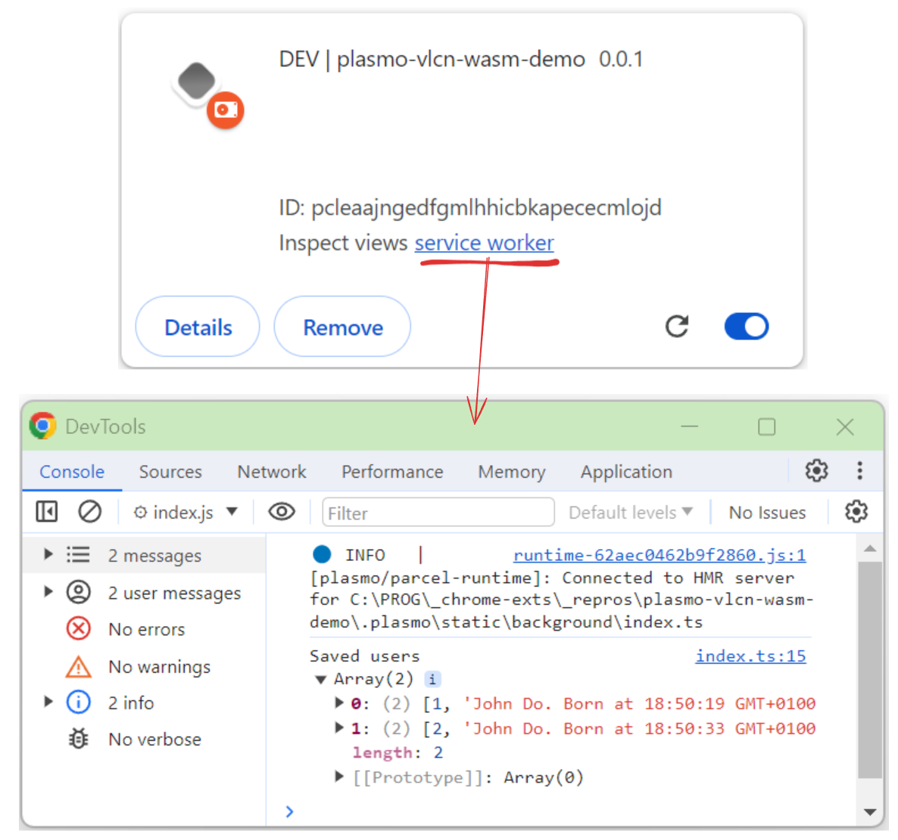

### Simple starter with

* Plasmo (browser extension framework)
* VLCN crsqlite (sqlite db in browser)

### Dev
Install deps and build
```shell
pnpm install
pnpm dev
```
Install extension in chrome

* Navigate to `chrome://extensions/`
* Add unpackaged app from `build/chrome-mv3-dev` in browser. (Activate dev mode first)
* Click on `service worker`

In the console you'll see data saved in sqlite and retrieved back.

It should look like


